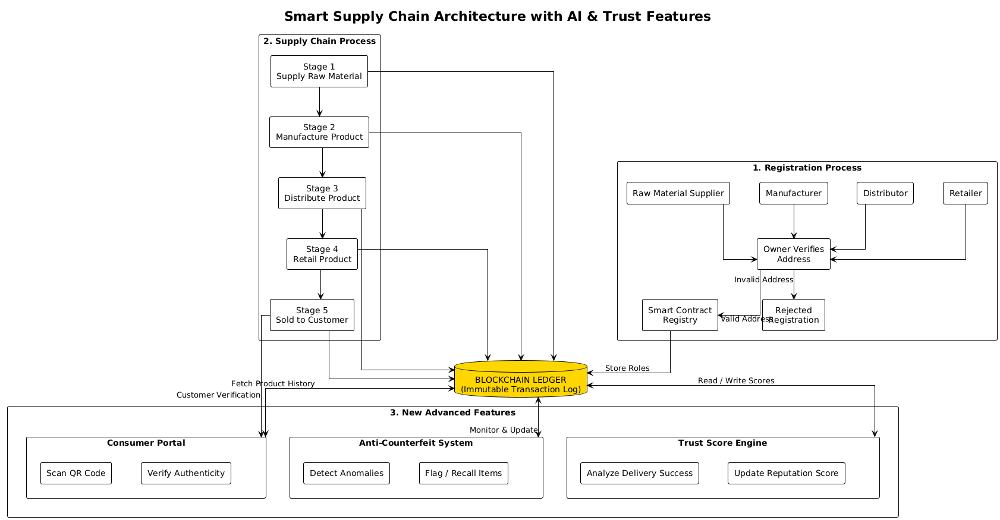

# Smart Supply Chain Blockchain



A robust, enterprise-grade Supply Chain Management system powered by **Ethereum Blockchain**, **AI-driven Anti-Counterfeit Intelligence**, and a **TrustScore Reputation System**. This project ensures authentic product provenance, transparent lifecycle tracking, and automated anomaly detection to prevent fraud.

---

## 🌟 Core Features

### 🛡️ AI-Powered Anti-Counterfeit Intelligence
*   **Risk Analysis Model**: Real-time analysis of supply chain data to detect anomalies and fraud.
*   **Automated Flagging**: Products exceeding risk thresholds are automatically flagged for review.
*   **Dynamic Risk Scoring**: Evaluates transaction timings, location consistency, and duplicate entries.

### 📊 TrustScore Reputation System
*   **Soulbound Tokens**: Non-transferable reputation identifiers for all supply chain participants.
*   **Performance-Based Scoring**: Scores update automatically based on successful, verified deliveries.
*   **Leaderboard**: Transparent ranking of participants (Platinum, Gold, Silver, Bronze) to incentivize compliance.

### 🔍 Public Verification Portal
*   **Instant Logic Verification**: End-users can scan QR codes to instantly verify product authenticity.
*   **Complete Provenance**: Visualizes the entire journey from raw material to retail shelf.
*   **Safety Alerts**: Immediate warnings for recalled or high-risk products.

---

## 🏗️ Architecture

The system is built on a modular architecture combining a decentralized ledger with off-chain AI services.

*   **Smart Contracts**: `SmartSupplyChain` (Logic) & `SmartTrustScore` (Reputation) deployed on Ethereum.
*   **Frontend**: React.js dashboard with Web3.js integration.
*   **AI Service**: Node.js microservice for anomaly detection and risk scoring.

---

## 🛠️ Tech Stack

*   **Blockchain**: Ethereum (Ganache for Dev, Sepolia for Testnet)
*   **Smart Contracts**: Solidity ^0.5.16
*   **Frontend**: React.js, CSS3 (Custom Design System)
*   **Backend**: Node.js, Express.js (Anomaly Service)
*   **Libraries**: Web3.js, Truffle Suite, QRCode.react

---

## 🚀 Getting Started

### Prerequisites
*   Node.js v14+
*   Ganache (Workspace: Port 8545, Network ID 1337)
*   MetaMask (Browser Extension)
*   Truffle (`npm install -g truffle`)

### Installation

1.  **Clone the Repository**
    ```bash
    git clone https://github.com/vikas-6/smart-supply-chain-blockchain.git
    cd smart-supply-chain-blockchain
    ```

2.  **Install Dependencies**
    ```bash
    # Root dependencies
    npm install

    # Client dependencies
    cd client
    npm install
    ```

3.  **Start Local Blockchain**
    *   Open **Ganache**.
    *   Create a workspace with **Port: 8545** and **Network ID: 1337**.

4.  **Deploy Contracts**
    ```bash
    # From the project root
    truffle migrate --reset
    ```

5.  **Run Application**
    ```bash
    cd client
    npm start
    ```
    The DApp will launch at `http://localhost:3000`.

---

## 📖 Usage Guide

### 1. Registration
*   The contract owner registers participants (Suppliers, Manufacturers, Distributors, Retailers).
*   Navigate to the **Assign Roles** page to onboard new entities.

### 2. Supply Chain Flow
*   **Order**: Initiate a new product batch.
*   **Supply -> Manufacture -> Distribute -> Retail**: Each participant logs their stage completion on the blockchain.
*   **Track**: Use the **Track** page to see the real-time status of any product ID.

### 3. Verification & Trust
*   **Verify**: Consumers use the **Verify** page (or scan QR) to check product history and risk score.
*   **Leaderboard**: Check the **TrustScore Board** to see top-performing partners.

---

## 📝 License

This project is licensed under the MIT License - see the [LICENSE](LICENSE) file for details.

---

<p align="center">
  **Built with ❤️ by Vikas Kumar**
</p>
